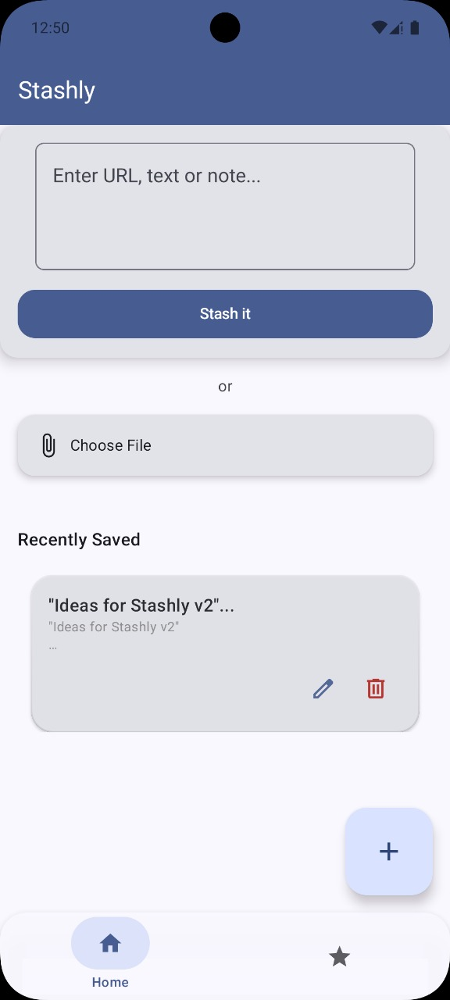
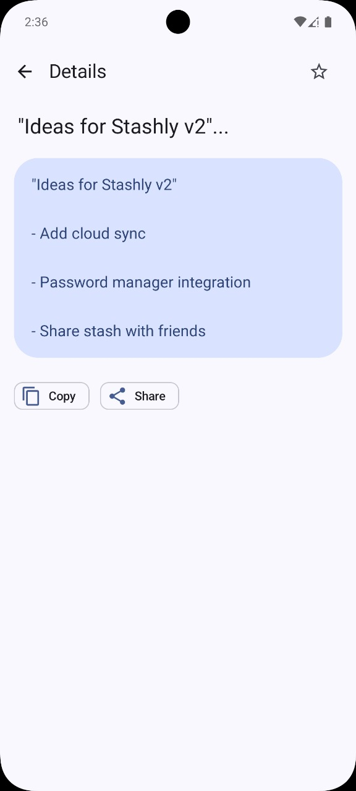
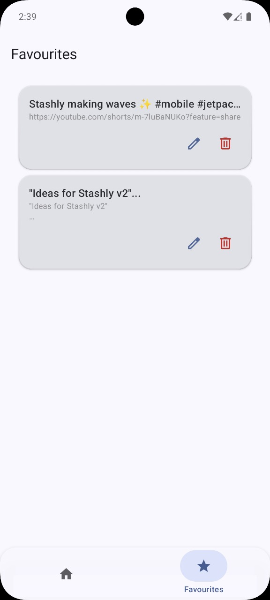
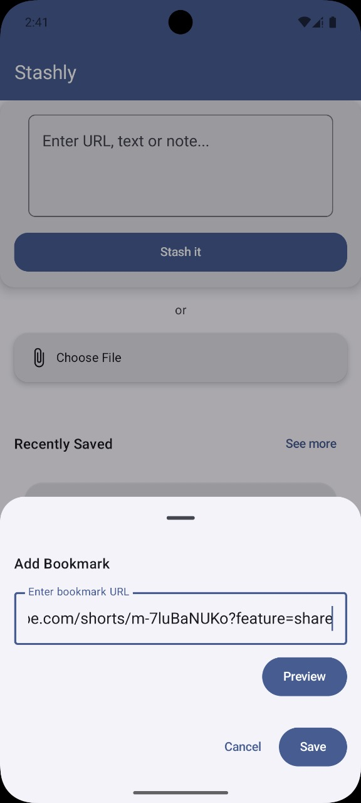

# Stashly  

A modern bookmarking and content-saving Android app built with **Jetpack Compose**.  
Stashly lets you save, organize, and view different types of content (text, links, files, etc.) with a clean and evolving UI.  

---

## Installation

> ### Or Download latest from [Releases](https://github.com/Dev-Aditya-More/Stashly/releases)

---

## ✨ Features
- Save text, links, and files 📑  
- Organized storage with cards 🗂  
- Modern UI with **Jetpack Compose** 🎨  
- Smooth **Shared Element Transitions** 🔄  

---

## UI 

> The app is still evolving! Here's how the UI looks 👇

  
  
  
  

---  

https://github.com/user-attachments/assets/48229af1-f9f7-4a00-84d8-990c3c9f34e8

https://github.com/user-attachments/assets/4411b1f7-de44-4cd6-bb40-f607b2805c72

---

## 🛠️ Tech Stack
- **Kotlin** – Primary language  
- **Jetpack Compose** – Declarative UI toolkit  
- **Navigation Compose** – Navigation & transitions  
- **Room** – Local storage (planned)  
- **Material 3** – Design system
- **Koin framework** - for Dependency Injection
- **Coil** - for Image Loading

---

Follow the journey on twitter here:
[my tweets](https://x.com/Adityaastwt)

Made with ❤️ by Dev-Aditya-More
